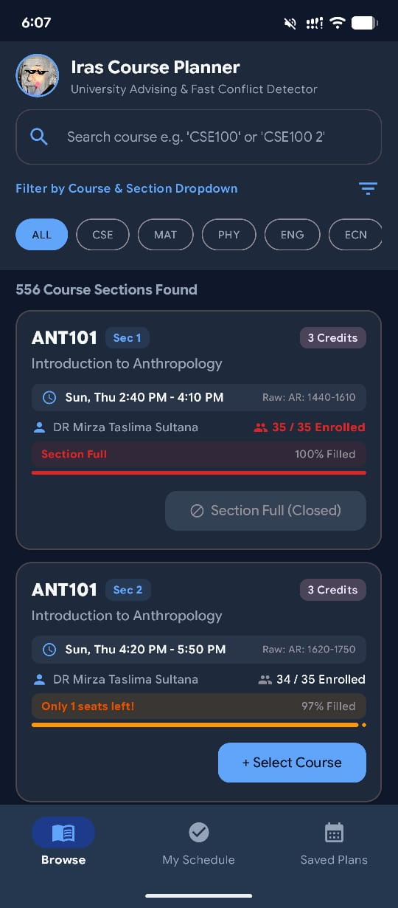
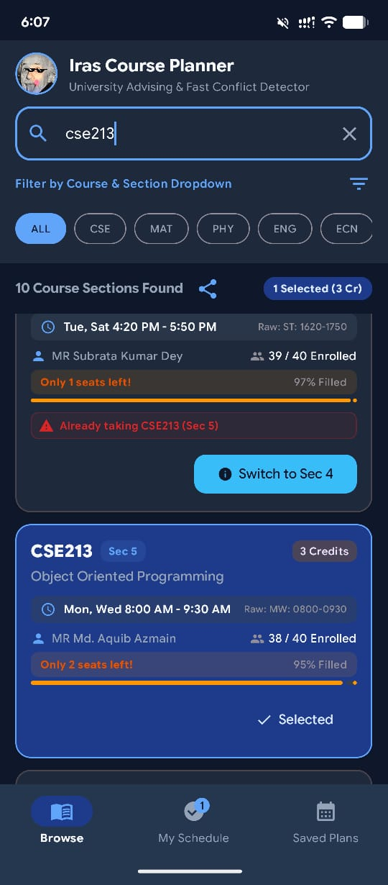
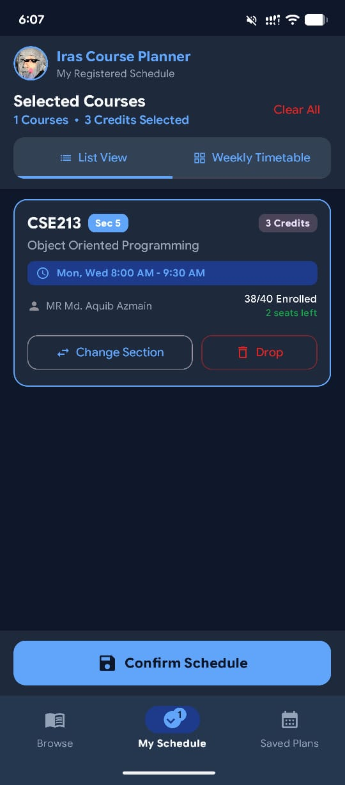
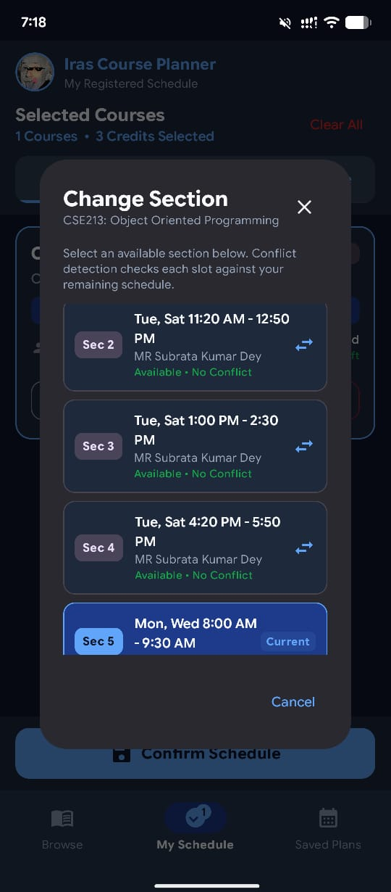
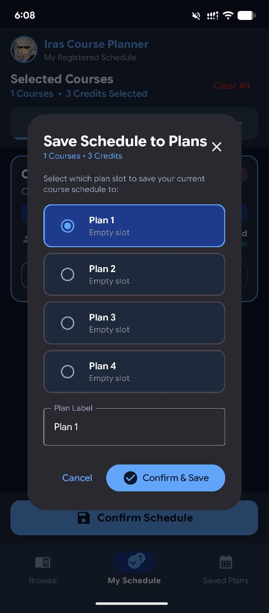
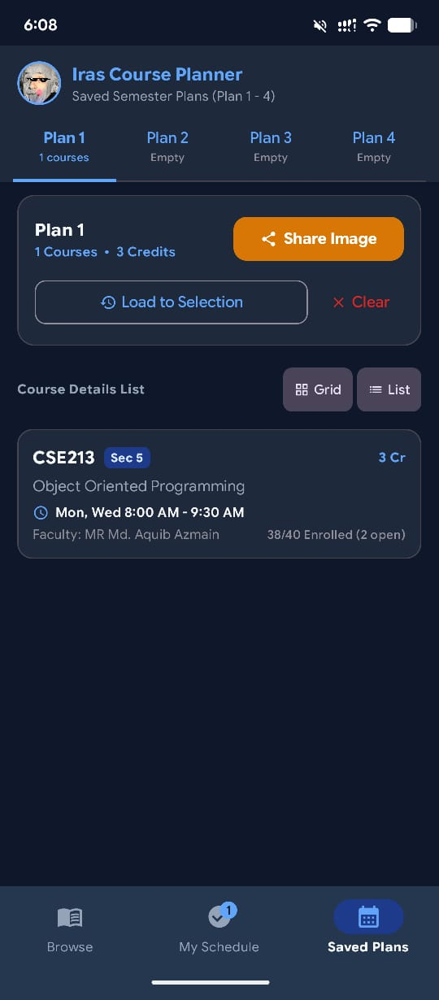
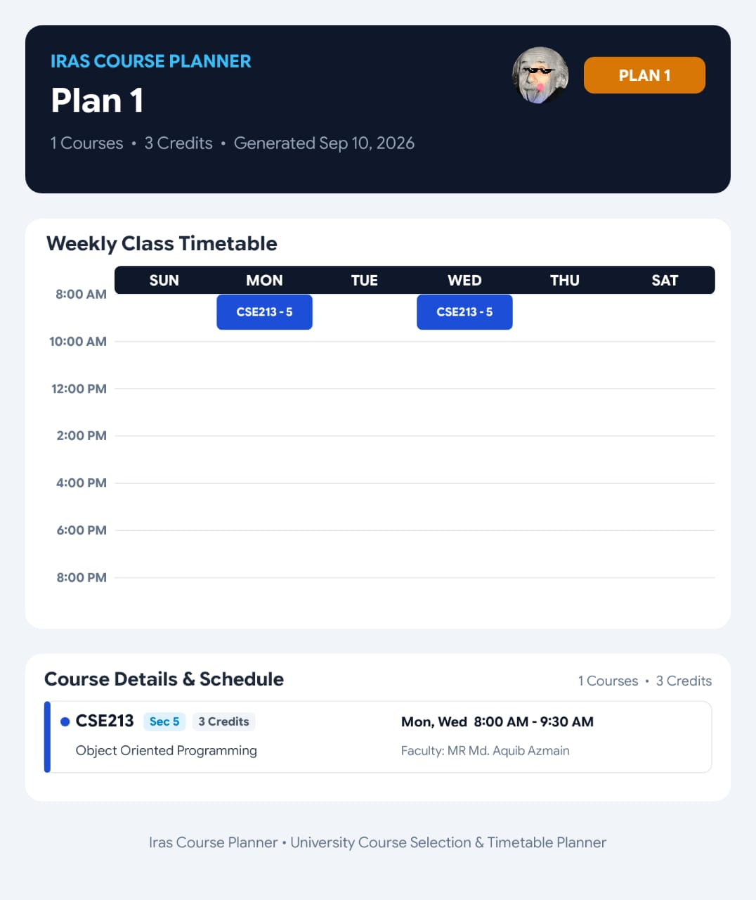
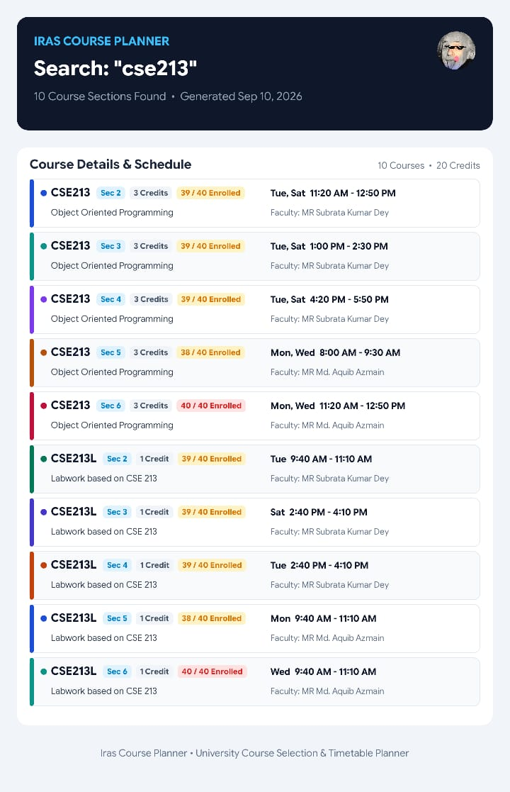

  
  <!-- Add your Einstein logo or a custom banner image here -->
  

  # 🎓 Iras Course Planner

  **A blazingly fast, beautifully designed university schedule builder for Android.**  
  *Say goodbye to overlapping classes and manual timetable drawing.*

  <!-- Badges -->
  

    
    
    
    
  

---

## ⚡ Why Iras Course Planner?

Building a university schedule shouldn't be a puzzle. Iras Course Planner uses a highly optimized **bitmask conflict detection engine** to instantly prevent schedule clashes as you add courses. Build, compare, and export visually clean, clash-free weekly timetables directly to your camera roll.

  <table>
    <tr>
      <td align="center"><b>🛡️ Bulletproof Scheduling</b> Instant conflict detection prevents you from adding overlapping classes.</td>
      <td align="center"><b>🔄 Seamless Swapping</b> Switch between lab, tutorial, and lecture sections with a single tap.</td>
      <td align="center"><b>🖼️ High-Res Export</b> Generate beautiful PNG timetables to set as your lock screen or share with friends.</td>
    </tr>
  </table>

---

## 📸 App Previews

Create a `previews` folder in your repository and upload your screenshots there to display them below.

### 📱 Exploring & Planning

  <table>
    <tr>
      <td align="center">
        
         <b>Smart Catalog</b>
      </td>
      <td align="center">
        
         <b>Conflict Detection</b>
      </td>
      <td align="center">
        
         <b>Selected Courses</b>
      </td>
    </tr>
    <tr>
      <td align="center">
        
         <b>Change Section</b>
      </td>
      <td align="center">
        
         <b>Save to Plans</b>
      </td>
      <td align="center">
        
         <b>Saved Semester Plans</b>
      </td>
    </tr>
  </table>

### 🖼️ Exported Timetables (High-Res)

  
   <b>Beautiful Weekly Timetables</b>
    
  
   <b>Clean Course Details Export</b>

---

## ✨ Features at a Glance

* **Real-time Conflict Engine:** Uses binary bitmasking against 15-minute time blocks for zero-latency clash detection.
* **Draft & Compare:** Create multiple schedule drafts, save them locally, and compare which semester plan works best.
* **Material Design 3:** Fluid animations, responsive layouts, and dynamic theming.
* **Offline First:** All data and saved plans are stored locally on your device. No internet required to plan your semester.

---

## 🛠️ Tech Stack & Architecture

Built with modern Android development practices to ensure performance and scalability:

* **[Kotlin](https://kotlinlang.org/):** 100% Kotlin codebase.
* **[Jetpack Compose](https://developer.android.com/jetpack/compose):** Declarative UI for smooth, responsive interfaces.
* **[Room Database](https://developer.android.com/training/data-storage/room):** Robust SQLite abstraction for local data persistence.
* **[Coroutines & Flow](https://kotlinlang.org/docs/coroutines-overview.html):** Asynchronous programming and reactive data streams.
* **Architecture:** Strict adherence to **Clean Architecture** and **MVVM** principles.

---
